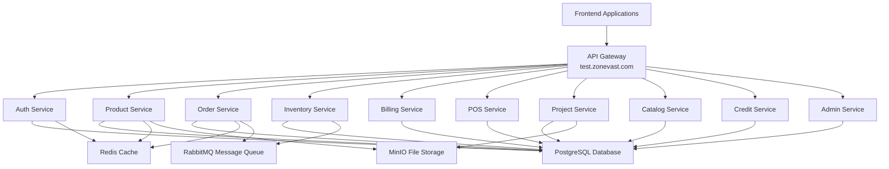

# ZoneVast Architecture Overview

ZoneVast is a comprehensive microservices ecosystem with frontend applications, backend services, and an API Gateway layer.

## System Architecture



## Frontend Applications

Frontend apps are built with **Next.js 14**, **React 18**, and **TypeScript**.

### Applications Overview

| Application | Description | Tech Stack |
|-------------|-------------|------------|
| **Portal** | Main entry point, authentication, dashboard | Next.js, NextUI |
| **ProductSuite** | Product catalog management | Next.js, Recharts |
| **InventorySuite** | Stock management, reservations | Next.js, D3.js |
| **OrderSuite** | Order processing, fulfillment | Next.js, Framer Motion |
| **DebtPro** | Debt tracking and management | Next.js, React Query |
| **RepairPro** | Repair service management | Next.js, Zustand |
| **BlogSuite** | Content management system | Next.js, MDX |
| **CustomerSuite** | CRM and customer management | Next.js, React Hook Form |

### Frontend Architecture

- **Framework**: Next.js 14 with App Router
- **UI Library**: NextUI components + Tailwind CSS
- **State Management**:
  - Zustand for global state
  - React Query for server state
  - React Context for theme/auth
- **Forms**: React Hook Form + Yup validation
- **Charts**: Recharts, D3.js
- **Internationalization**: next-intl (Arabic/English)
- **Authentication**: JWT tokens with localStorage/cookies
- **Styling**: Tailwind CSS with custom theme

### Frontend Communication

Frontend apps communicate with backend through:
- **REST API**: Direct calls to Django services
- **GraphQL**: Apollo Client with code generation
- **API Gateway**: All production traffic goes through SAM Gateway

## Backend Services

Backend services are built with **Django** and **Django REST Framework**.

### Core Services

| Service | Description | Database |
|---------|-------------|----------|
| **zv-auth-service** | Authentication, JWT tokens, RBAC | zv_auth_db |
| **zv-product-eco-service** | Product catalog, categories, tags | zv_product_db |
| **zv-inventory-eco-service** | Stock management, reservations | zv_inventory_db |
| **zv-order-eco-service** | Order processing, fulfillment | zv_order_db |
| **zv-billing-eco-service** | Payment processing, invoicing | zv_billing_db |
| **zv-pos-eco-service** | Point of sale, in-store transactions | zv_pos_db |
| **zv-project-service** | Project management, file attachments | zv_project_db |
| **zv_catalog_service** | Service catalog and marketplace | zv_catalog_db |
| **zv_credit_finance_service** | Credit and finance management | zv_credit_db |
| **zv_admin_interface** | Admin dashboard and monitoring | zv_admin_db |

### Backend Architecture

- **Framework**: Django 4.2+ with Django REST Framework
- **API Style**: REST (primary), GraphQL (via Graphene)
- **Authentication**: JWT tokens (djangorestframework-simplejwt)
- **Database**: PostgreSQL 13 (separate DB per service)
- **Message Broker**: RabbitMQ for async tasks
- **Caching**: Redis for session and query caching
- **File Storage**: MinIO (S3-compatible)
- **Deployment**: Docker + AWS Lambda support

### Service Communication

Services communicate through:
- **HTTP/REST**: Synchronous calls between services
- **RabbitMQ**: Asynchronous messaging
- **GraphQL**: For frontend queries (via Graphene)
- **Kong Gateway**: Production API routing

## API Gateway

### API Gateway

The API Gateway layer routes all incoming requests to appropriate services.

**Gateway URL**: `https://test.zonevast.com`

### Routing Patterns

**REST API Pattern:**
```
https://test.zonevast.com/api/v1/{service-name}/{endpoint}
```

Examples:
- `https://test.zonevast.com/api/v1/auth/login/`
- `https://test.zonevast.com/api/v1/product/products/`
- `https://test.zonevast.com/api/v1/inventory/items/`

**GraphQL Pattern:**
```
https://test.zonevast.com/graphql/{service-name}
```

Examples:
- `https://test.zonevast.com/graphql/product`
- `https://test.zonevast.com/graphql/inventory`
- `https://test.zonevast.com/graphql/order`

### Gateway Features

- **Authentication**: JWT validation on all routes
- **Rate Limiting**: Per-IP and per-user limits
- **CORS**: Configured for frontend domains
- **Request/Response Logging**: All API calls logged
- **Error Handling**: Standardized error responses
- **Load Balancing**: Distributes traffic across service instances

## Base URLs

### Staging (Test Environment)

| Type | URL |
|------|-----|
| REST API | `https://test.zonevast.com/api/v1` |
| GraphQL | `https://test.zonevast.com/graphql/{service}` |
| Frontend | `https://test.zonevast.com` |

### Production

| Type | URL |
|------|-----|
| REST API | `https://api.zonevast.com/api/v1` |
| GraphQL | `https://api.zonevast.com/graphql/{service}` |
| Frontend | `https://zonevast.com` |

## Data Flow

### Authentication Flow

```
1. User → Frontend (Portal) → Login Request
2. Frontend → API Gateway → Auth Service (/api/v1/auth/login/)
3. Auth Service → PostgreSQL → Validate credentials
4. Auth Service → Generate JWT token
5. Auth Service → API Gateway → Frontend (JWT token)
6. Frontend → Store token in localStorage/cookie
7. Frontend → Include token in Authorization header
8. API Gateway → Validate JWT on every request
```

### API Request Flow

```
1. Frontend → API Request with JWT
2. API Gateway → Validate JWT token
3. API Gateway → Route to appropriate service
4. Service → Business logic + Database queries
5. Service → Response to API Gateway
6. API Gateway → Response to Frontend
```

### GraphQL Flow

```
1. Frontend → GraphQL Query/Mutation
2. Apollo Client → Add JWT token to headers
3. API Gateway → Route to GraphQL service
4. Graphene (Django) → Execute query
5. Service → Query database/resolver functions
6. Service → Return JSON response
7. Frontend → Update UI with data
```

## Infrastructure

### Database Layer

- **PostgreSQL 13**: Primary database for all services
- **Separate databases per service**: Isolation and scalability
- **Connection pooling**: PgBouncer for efficient connections
- **Backups**: Daily automated backups

### Caching Layer

- **Redis**: Session storage, query caching
- **TTL**: Configurable cache expiration
- **Cache invalidation**: Manual and automatic

### Message Queue

- **RabbitMQ**: Asynchronous task processing
- **Queues**: Service-specific queues
- **Exchanges**: Topic-based routing

### File Storage

- **MinIO**: S3-compatible object storage
- **Buckets**: Organized by service and type
- **CDN**: CloudFront for static assets

## Security

### Authentication

- **JWT Tokens**: Short-lived access tokens (15 min)
- **Refresh Tokens**: Long-lived refresh tokens (7 days)
- **Token Storage**: httpOnly cookies in production

### Authorization

- **RBAC**: Role-Based Access Control
- **Permissions**: Granular permissions per resource
- **Project-based**: Users have access to specific projects

### Network Security

- **HTTPS**: All communication encrypted
- **CORS**: Strict origin validation
- **Rate Limiting**: Prevent abuse
- **API Gateway**: Centralized security policies

## Scalability

### Horizontal Scaling

- **Stateless services**: Easy horizontal scaling
- **Load balancer**: Distributes traffic
- **Auto-scaling**: Based on CPU/memory metrics

### Vertical Scaling

- **Database optimization**: Indexing, query optimization
- **Caching**: Reduce database load
- **Connection pooling**: Efficient resource usage

## Deployment

### Production

- **AWS Lambda**: Serverless deployment
- **ECS Containers**: Docker container orchestration
- **CI/CD Pipeline**: Automated testing and deployment
- **Blue-Green Deployment**: Zero downtime updates

## Monitoring

### Application Monitoring

- **Health checks**: `/health/` endpoint on all services
- **Logging**: Centralized logging (CloudWatch)
- **Metrics**: Performance metrics (Prometheus)

### Error Tracking

- **Sentry**: Error aggregation and alerting
- **Logging**: Structured JSON logs
- **Alerts**: Email/Slack notifications

## Next Steps

- Read [API Basics](./api-basics.md) for authentication details
- Read [Examples](./examples.md) for implementation patterns
- Check [Package](./package.md) for SDK information
