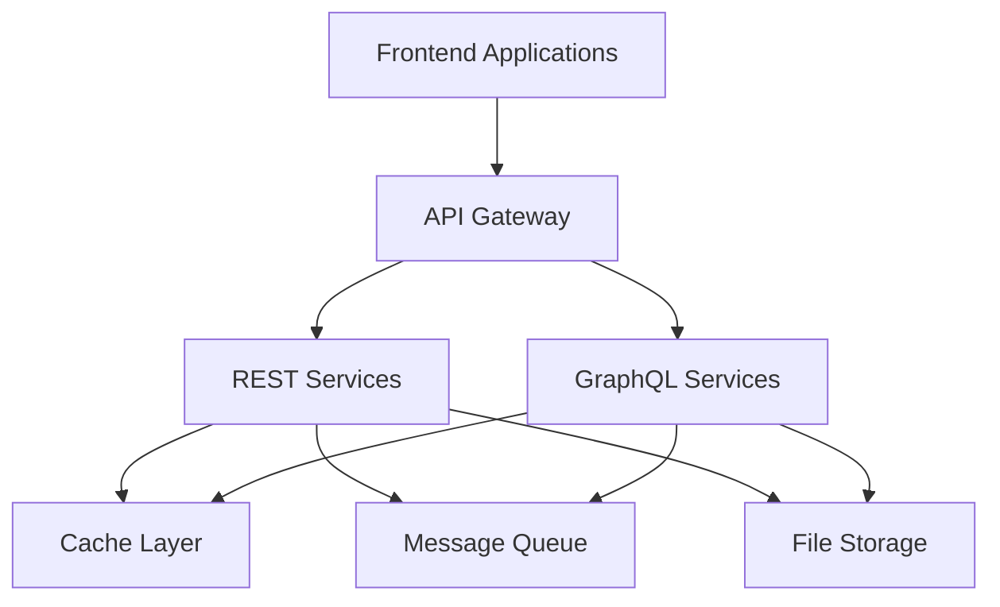

# ZoneVast Architecture Overview

ZoneVast is a microservices platform with frontend applications, backend services, and an API Gateway layer.

## System Architecture

## Core Concepts

### Microservices Architecture

ZoneVast uses a microservices architecture where each service has a specific responsibility:
- **REST Services**: For authentication, project management, and file operations
- **GraphQL Services**: For business domains like products, orders, inventory, billing

### API Gateway

All requests go through the API Gateway which handles:
- Authentication (JWT validation)
- Rate limiting
- Request routing to appropriate services
- CORS management

### Frontend Applications

Frontend apps are built with **Next.js 14**, **React 18**, and **TypeScript**. They communicate with backend through:
- REST API for authentication and project operations
- GraphQL for business data queries

### Backend Services

Backend services are built with **Django** and **Django REST Framework**:
- REST services for stateless operations
- GraphQL services for complex data queries
- Message queue (RabbitMQ) for async tasks
- Redis caching for performance

### Communication Patterns

Services communicate through:
- **HTTP/REST**: Synchronous calls between services
- **RabbitMQ**: Asynchronous messaging for background tasks
- **GraphQL**: For frontend queries with code generation

## Base URLs

| Type | URL Pattern | Example |
|------|-------------|---------|
| REST API | `https://test.zonevast.com/api/v1/{service}/{endpoint}` | `/api/v1/auth/login/` |
| GraphQL | `https://test.zonevast.com/graphql/{service}` | `/graphql/product` |

## Security

- **JWT Tokens**: Short-lived access tokens (15 min) with refresh tokens
- **RBAC**: Role-Based Access Control with project-level permissions
- **HTTPS**: All communication encrypted
- **Rate Limiting**: Per-IP and per-user limits

## Scalability

- **Horizontal Scaling**: Stateless services scale easily
- **Caching**: Redis reduces load on services
- **Message Queue**: Async processing for heavy operations

## Next Steps

- Read [API Basics](./api-basics.md) for authentication details
- Read [Examples](./examples.md) for implementation patterns
- See [API Reference](../api/) for detailed endpoint documentation
- See [Apps](../apps/) for frontend application details
