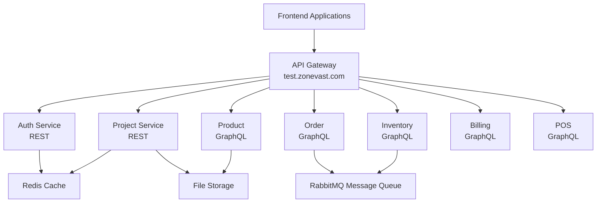

# ZoneVast Architecture Overview

ZoneVast is a microservices platform with frontend applications, backend services, and an API Gateway layer.

## System Architecture



## Frontend Applications

Frontend apps are built with **Next.js 14**, **React 18**, and **TypeScript**.

### Applications Overview

| Application | Description | URL |
|-------------|-------------|-----|
| **Portal** | Main entry point, authentication, dashboard | https://test.zonevast.com |
| **ProductSuite** | Product catalog management | https://test.zonevast.com/products |
| **InventorySuite** | Stock management, reservations | https://test.zonevast.com/inventory |
| **OrderSuite** | Order processing, fulfillment | https://test.zonevast.com/orders |
| **DebtPro** | Debt tracking and management | https://test.zonevast.com/debt |
| **RepairPro** | Repair service management | https://test.zonevast.com/repair |
| **BlogSuite** | Content management system | https://test.zonevast.com/blog |
| **CustomerSuite** | CRM and customer management | https://test.zonevast.com/customers |

### Frontend Architecture

- **Framework**: Next.js 14 with App Router
- **UI Library**: NextUI components + Tailwind CSS
- **State Management**:
  - Zustand for global state
  - React Query for server state
  - React Context for theme/auth
- **Forms**: React Hook Form + Yup validation
- **Charts**: Recharts, D3.js
- **Internationalization**: next-intl (Arabic/English)
- **Authentication**: JWT tokens with localStorage/cookies
- **Styling**: Tailwind CSS with custom theme

## Backend Services

### REST Services (Online)

| Service | Description | Base URL |
|---------|-------------|----------|
| **Auth Service** | Authentication, JWT tokens, RBAC | `https://test.zonevast.com/api/v1/auth` |
| **Project Service** | Project management, file attachments | `https://test.zonevast.com/api/v1/projects` |

### GraphQL Services (Online)

| Service | Description | GraphQL Endpoint |
|---------|-------------|------------------|
| **Product** | Product catalog, categories, pricing | `https://test.zonevast.com/graphql/product` |
| **Order** | Order processing, fulfillment, tracking | `https://test.zonevast.com/graphql/order` |
| **Inventory** | Stock management, reservations, movements | `https://test.zonevast.com/graphql/inventory` |
| **Billing** | Payments, invoices, subscriptions | `https://test.zonevast.com/graphql/billing` |
| **POS** | Point of sale, in-store transactions | `https://test.zonevast.com/graphql/pos` |

### Backend Architecture

- **Framework**: Django 4.2+ with Django REST Framework
- **API Style**: REST (Auth, Project), GraphQL (Product, Order, Inventory, Billing, POS)
- **Authentication**: JWT tokens (djangorestframework-simplejwt)
- **Message Broker**: RabbitMQ for async tasks
- **Caching**: Redis for session and query caching
- **File Storage**: S3-compatible object storage
- **Deployment**: AWS Lambda support

### Service Communication

Services communicate through:
- **HTTP/REST**: Synchronous calls between services
- **RabbitMQ**: Asynchronous messaging
- **GraphQL**: For frontend queries (via Graphene)
- **API Gateway**: Production API routing

## API Gateway

The API Gateway layer routes all incoming requests to appropriate services.

**Gateway URL**: `https://test.zonevast.com`

### REST API Pattern

```
https://test.zonevast.com/api/v1/{service}/{endpoint}
```

**Examples:**
- Auth: `https://test.zonevast.com/api/v1/auth/login/`
- Project: `https://test.zonevast.com/api/v1/projects/`

### GraphQL Pattern

```
https://test.zonevast.com/graphql/{service}
```

**Examples:**
- Product: `https://test.zonevast.com/graphql/product`
- Order: `https://test.zonevast.com/graphql/order`
- Inventory: `https://test.zonevast.com/graphql/inventory`
- Billing: `https://test.zonevast.com/graphql/billing`
- POS: `https://test.zonevast.com/graphql/pos`

### Gateway Features

- **Authentication**: JWT validation on all routes
- **Rate Limiting**: Per-IP and per-user limits
- **CORS**: Configured for frontend domains
- **Request/Response Logging**: All API calls logged
- **Error Handling**: Standardized error responses
- **Load Balancing**: Distributes traffic across service instances

## Base URLs

| Type | URL |
|------|-----|
| REST API | `https://test.zonevast.com/api/v1` |
| GraphQL | `https://test.zonevast.com/graphql/{service}` |
| Frontend | `https://test.zonevast.com` |

## Data Flow

### Authentication Flow

```
1. User → Frontend → Login Request
2. Frontend → API Gateway → Auth Service (/api/v1/auth/login/)
3. Auth Service → Validate credentials
4. Auth Service → Generate JWT token
5. Auth Service → API Gateway → Frontend (JWT token)
6. Frontend → Store token in localStorage/cookie
7. Frontend → Include token in Authorization header
8. API Gateway → Validate JWT on every request
```

### GraphQL Flow

```
1. Frontend → GraphQL Query/Mutation
2. Apollo Client → Add JWT token to headers
3. API Gateway → Route to GraphQL service
4. Graphene (Django) → Execute query
5. Service → Return JSON response
6. Frontend → Update UI with data
```

## Security

### Authentication

- **JWT Tokens**: Short-lived access tokens (15 min)
- **Refresh Tokens**: Long-lived refresh tokens (7 days)
- **Token Storage**: httpOnly cookies in production

### Authorization

- **RBAC**: Role-Based Access Control
- **Permissions**: Granular permissions per resource
- **Project-based**: Users have access to specific projects

### Network Security

- **HTTPS**: All communication encrypted
- **CORS**: Strict origin validation
- **Rate Limiting**: Prevent abuse
- **API Gateway**: Centralized security policies

## Scalability

### Horizontal Scaling

- **Stateless services**: Easy horizontal scaling
- **Load balancer**: Distributes traffic
- **Auto-scaling**: Based on CPU/memory metrics

### Vertical Scaling

- **Query optimization**: Indexing, query optimization
- **Caching**: Reduce load
- **Connection pooling**: Efficient resource usage

## Deployment

- **AWS Lambda**: Serverless deployment
- **ECS Containers**: Docker container orchestration
- **CI/CD Pipeline**: Automated testing and deployment
- **Blue-Green Deployment**: Zero downtime updates

## Monitoring

### Application Monitoring

- **Health checks**: `/health/` endpoint on all services
- **Logging**: Centralized logging (CloudWatch)
- **Metrics**: Performance metrics (Prometheus)

### Error Tracking

- **Sentry**: Error aggregation and alerting
- **Logging**: Structured JSON logs
- **Alerts**: Email/Slack notifications

## Next Steps

- Read [API Basics](./api-basics.md) for authentication details
- Read [Examples](./examples.md) for implementation patterns
- Check [Package](./package.md) for SDK information
